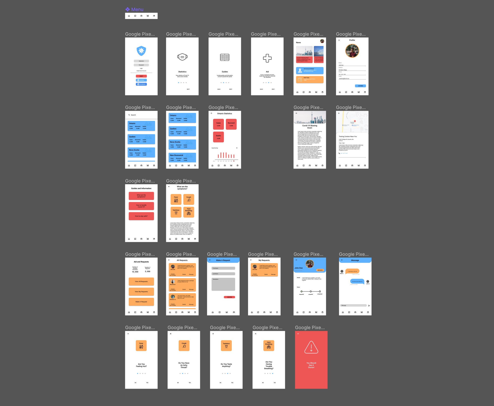

# HCI-CovidApp-Prototype
Prototype Design of a Covid-19 Application designed to inform and bring volunteers and people in need together

---
Current Status: IN PROGRESS
---

## Versions
1. [Ver. 1](https://www.figma.com/file/7zhSWpL5QloWA26xfrHxzw/Covid-Tracker-App?node-id=7%3A2)
2. [Ver. 2](https://www.figma.com/file/eugMTD2Yb67kmQErBw0rdi/Covid-Tracker-App-V2.0?node-id=202%3A542) - WIP

## Demo
1. [Ver. 1 Demo](https://www.figma.com/proto/7zhSWpL5QloWA26xfrHxzw/Covid-Tracker-App?node-id=49%3A327&scaling=min-zoom)
2. [Ver. 2 Demo](https://www.figma.com/proto/eugMTD2Yb67kmQErBw0rdi/Covid-Tracker-App-V2.0?node-id=202%3A543&viewport=411%2C158%2C0.18928709626197815&scaling=scale-down)

## Functionality

* Login/Register
* Perform self-assesment tests
* Book appointments and tests
* Recieve latest news
* View Covid-19 statistics
* Create or accpet community requests for aid
* Recieve lockdown status and emergency alerts for your area

## Screenshots

### Initial Design

### Version 2 Redesign

